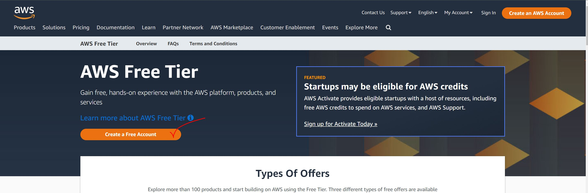
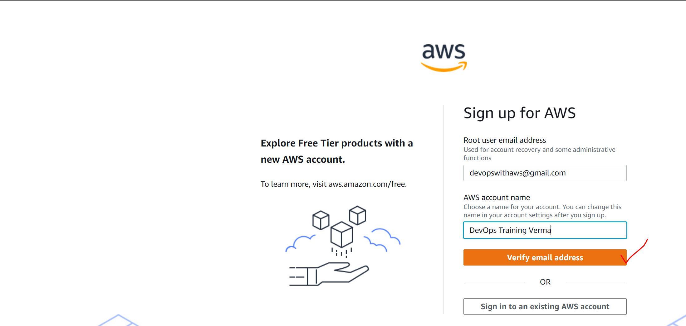
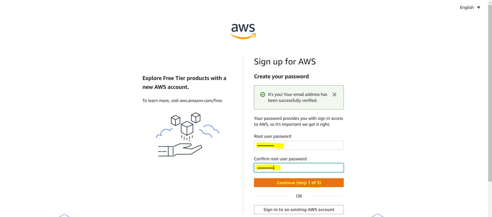
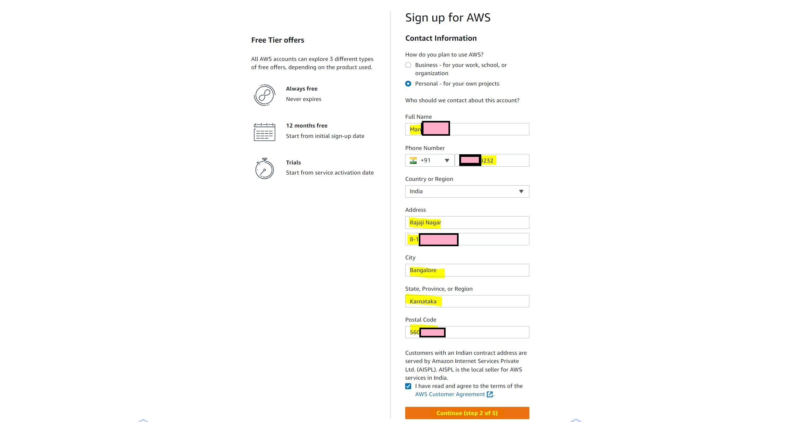
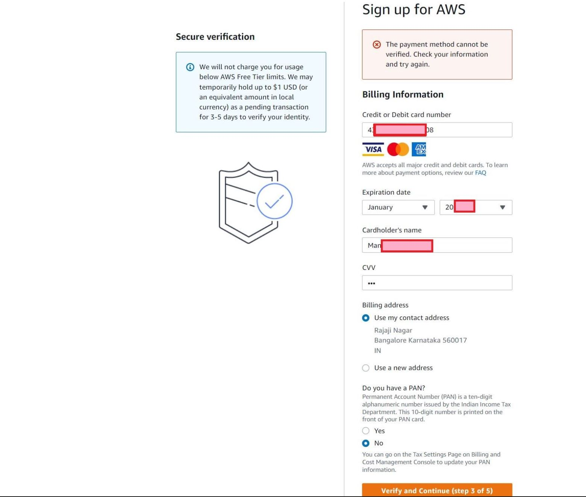
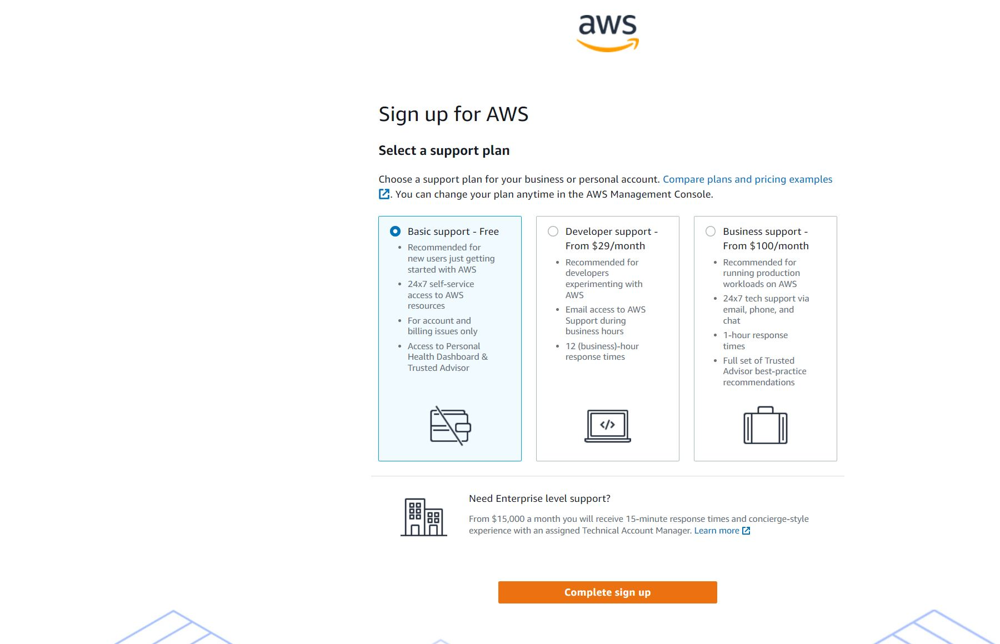
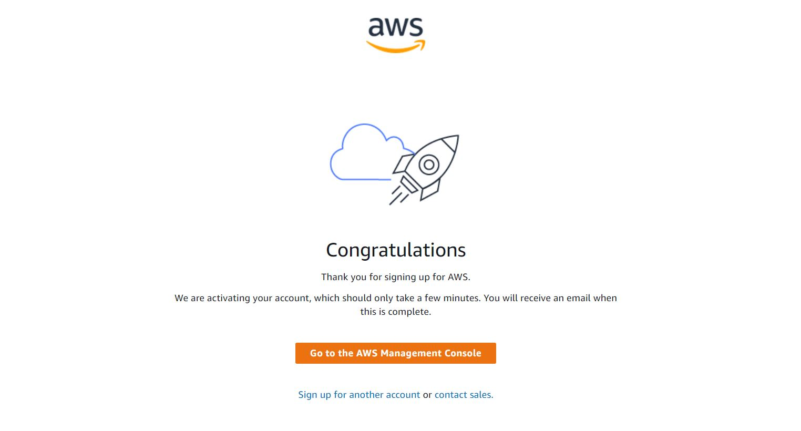
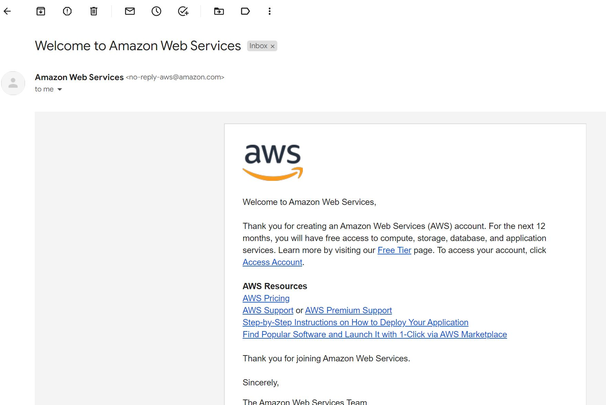

### AWS Acccount Creation Procedure

Here are the detailed steps to create an account on AWS and AWS Offer a free-tier account for 1 year.

1) Search for AWS FREE TIER ACCOUNT in google and click the first link

2) Now click on Click Free Tier Account

3) Now Enter your email address and name of the account of your choice. Since it's training account I am giving DevOps Training as name.

4) Enter a password in Alpha-Numeric and this will be AWS Cloud Password which will be used for further authentication.

5) Now for billing purpose, enter your residential details as show below and click on `CONTINUE`

6) AWS has to verify that you're human and a valid user. This will be done by deduction 2rs from your bank account. So, you need to enter your valid credit card details ( Credit card id preferred for quick activation of the account. Debit card activation takes time).

7) Once after your money 2.rs is deducted from your account, we are good. Now click on the Plan `Basic Support - FREE`

8) We are good!!!

9) Now you will get an email on he account activation as shown :

10) That's all !!! Yayyyyy  . . . Your account is activated.
